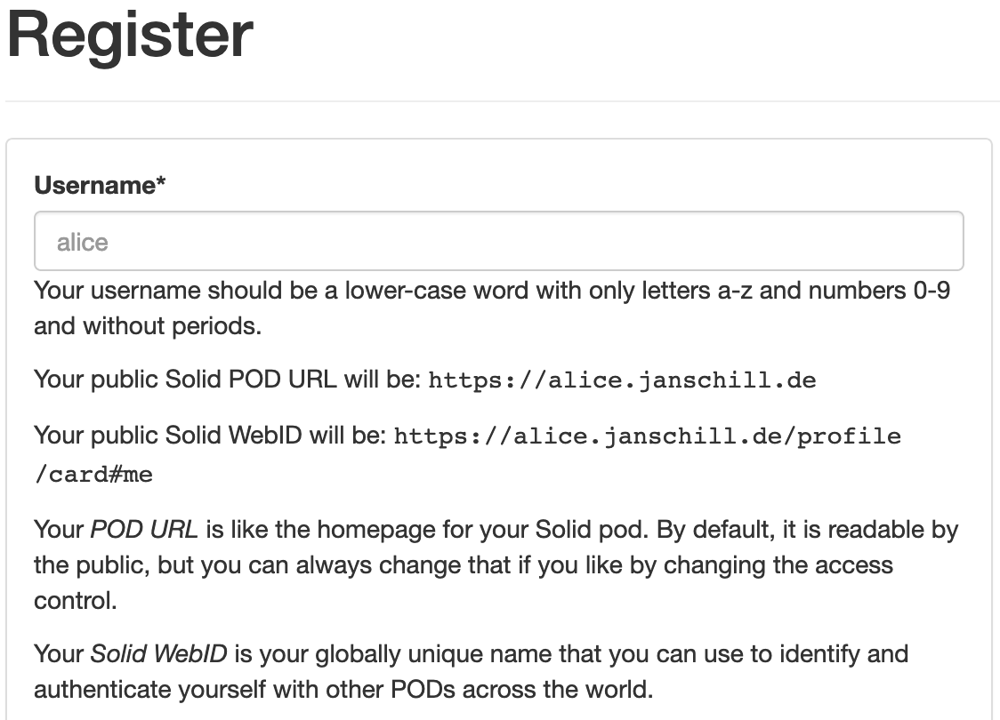

# Pod

## Setup

### Containerized

- [NGINX proxy with Let's Encrypt certificates](https://github.com/evertramos/docker-compose-letsencrypt-nginx-proxy-companion), only problem when using this: [Running Solid behind a reverse proxy](#running-solid-behind-a-reverse-proxy)
- [https://github.com/angelo-v/docker-solid-server](https://github.com/angelo-v/docker-solid-server) provides a one-click solution. I think this uses single-user mode though.

### Running Solid behind a reverse proxy

TODO: understand this completely.

>One of Solid's authentication mechanisms is WebID-TLS: the client sends its client certificate during the TLS handshake. However, by default, this requires the client to set up a TLS connection directly with the Solid server: if the TLS handshake is performed by an intermediary, the Solid server cannot see the client certificate.

This mechanism is called [TLS Client Auth](https://blog.cloudflare.com/introducing-tls-client-auth/#handshakeswithtlsclientauth) and adds an extra layer of security, when API keys are compromised mid-connection, the certificates are encrypted and cannot be reused.

See the [source](https://github.com/solid/node-solid-server/wiki/Running-Solid-behind-a-reverse-proxy) for a working solutions.

### Without Docker

This [tutorial](https://solidproject.org/for-developers/pod-server) was followed when the pod was set up without the usage of any containerization.

1. Set up wildcard certificate issuing to be able to use HTTPS on new subdomains for a multiuser Solid pod.

```bash
# Install certbot
apt install certbot
# Issue certificates
certbot certonly \
--manual \
--preferred-challenges=dns \
--email schill@hey.com \
--server https://acme-v02.api.letsencrypt.org/directory \
--agree-tos \
-d janschill.de -d *.janschill.de
```

2. Add TXT DNS records on DNS host. The command above will deliver the key and value. This can take a bit of time, so make sure the entries are registered before continuing.

```bash
nslookup -type=txt _acme-challenge.janschill.de
```

3. Make sure correct user permissions are given to the new certificate files.

```bash
chmod -R 755 /etc/letsencrypt/live/
```

4. Configure reverse proxy

This is strictly speaking not needed and at the moment not being capitalized. A reverse proxy allows a server to run multiple services on the same port. A reverse proxy receives the initial request on the host and port and then forwards it to the configured local service on the machine.

>One of Solid's authentication mechanisms is WebID-TLS: the client [sends its client certificate during the TLS handshake](https://blog.cloudflare.com/introducing-tls-client-auth/#handshakeswithtlsclientauth). However, by default, this requires the client to set up a TLS connection directly with the Solid server: if the TLS handshake is performed by an intermediary, the Solid server cannot see the client certificate [Source](https://github.com/solid/node-solid-server/wiki/Running-Solid-behind-a-reverse-proxy).

Configuration for NGINX as reverse proxy to make it work with the Node Solid Server (NSS).

```
# Configuration for NGINX as reverse proxy
# Nginx configuration for Solid on Port 8443
## Redirects all HTTP traffic to the HTTPS host
server {
  ## In case of conflict, either remove "default_server" from the listen line below,
  ## or delete the /etc/nginx/sites-enabled/default file.
  listen 0.0.0.0:80;
  listen [::]:80;
  server_name janschill.de;
  server_tokens off; ## Don't show the nginx version number, a security best practice
  return 301 https://$http_host$request_uri;
  access_log  /var/log/nginx/solid_access.log;
  error_log   /var/log/nginx/solid_error.log;
}

server {
  listen *:443 ssl;
  listen [::]:443 ssl;
  server_name janschill.de;
  server_tokens off;

  access_log  /var/log/nginx/solid_ssl_access.log;
  error_log   /var/log/nginx/solid_ssl_error.log;

ssl_certificate /etc/letsencrypt/live/janschill.de/fullchain.pem;
ssl_certificate_key /etc/letsencrypt/live/janschill.de/privkey.pem;

root /var/www/janschill.de; #webroot

  ## [Optional] Enable HTTP Strict Transport Security
  ## HSTS is a feature improving protection against MITM attacks
  ## For more information see: https://www.nginx.com/blog/http-strict-transport-security-hsts-and-nginx/
  add_header Strict-Transport-Security "max-age=31536000; includeSubDomains";

  location / {
    proxy_pass https://localhost:8443;

    gzip off;
    proxy_redirect off;

    ## Some requests take more than 30 seconds.
    proxy_read_timeout      300;
    proxy_connect_timeout   300;
    proxy_redirect          off;

    proxy_http_version 1.1;

    proxy_set_header    Host                $http_host;
    proxy_set_header    X-Real-IP           $remote_addr;
    proxy_set_header    X-Forwarded-Ssl     on;
    proxy_set_header    X-Forwarded-For     $proxy_add_x_forwarded_for;
    proxy_set_header    X-Forwarded-Proto   $scheme;
  }

}
```

*[Source for the configuration](https://solidproject.org/for-developers/pod-server/nginx)*

Restart NGINX

```bash
systemctl restart nginx
```

5. Initialize Solid

```bash
solid init
# Path to the folder you want to serve. Default is (./data)
/var/www/janschill.de/data
# SSL port to run on. Default is (8443)
8443
# Solid server uri (with protocol, hostname and port)
https://janschill.de
# Enable WebID authentication
Yes
# Serve Solid on URL path
/
# Path to the config directory (for example: /etc/solid-server) (./config)
/var/www/janschill.de/config
# Path to the config file (for example: ./config.json) (./config.json)
/var/www/janschill.de/config.json
# Path to the server metadata db directory (for users/apps etc) (./.db)
/var/www/janschill.de/.db
# Path to the SSL private key in PEM format
/etc/letsencrypt/live/janschill.de/privkey.pem
# Path to the SSL certificate key in PEM format
/etc/letsencrypt/live/janschill.de/fullchain.pem
# Enable multi-user mode
Yes
# Do you want to set up an email service (y/N)
N
# A name for your server (not required)
janschill.de
# A description of your server (not required)
undefined
# A logo (not required)
undefined
# Do you want to enforce Terms & Conditions for your service (y/N)
N
# Do you want to disable password strength checking (y/N)
N
# The support email you provide for your users (not required)
undefined
```

5. Create directories

```bash
mkdir -p /var/www/janschill.de/config
mkdir /var/www/janschill.de/data
mkdir /var/www/janschill.de/.db
```

6. Make sure correct user permissions are given `chown -R 1000:1000 /var/www/janschill.de/`

## Lessons learned

- Wildcard certificates are not available with the popular Let's Encrypt Docker image. This is because it does not support. More information around this, can be found in this [issue](https://github.com/nginx-proxy/docker-letsencrypt-nginx-proxy-companion/issues/319). Why was this needed in the first place? Because when wanting to set up and run a multiuser Solid pod, wildcard certificates are needed, as the server will create {username}.janschill.de subdomains to host their user base.
  - [Docker NGINX with Let's Encrypt](https://github.com/evertramos/docker-compose-letsencrypt-nginx-proxy-companion)
  - [Docker with Solid pod, NGINX reverse proxy, Let's Encrypt](https://github.com/angelo-v/docker-solid-server/blob/master/examples/docker-compose.all-in-one.yml). This is nice, but only allows single-user mode and not multiuser.
  - When setting up the one-click version use janschill.de as host
- Running Solid behind a reverse proxy. [Source](https://github.com/solid/node-solid-server/wiki/Running-Solid-behind-a-reverse-proxy)
- Do not use certbot-auto with Ubuntu
- Make sure the correct config.json is getting populated and used by the Solid server
- Use `netstat -tulpen` to debug running applications and their ports.

## Useful commands

```bash
netstat -tulpen # List of running servers
nmap janschill.de # Scan all open ports
```

Request the ACL file for the root container, which is inherited down to every container, if not stated otherwise.

```bash
http GET https://janschill.solidcommunity.net/.acl 'authorization: Bearer …'
```

## Explanation

### Single-user

### Multi-user

Multiuser mode enables visitors to register their WebIDs: username.janschill.de

```bash
solid init
..
? Allow users to register their WebID (y/N) # write `y` here
..
solid start
```

Or when using flags:

```bash
solid start --multiuser …
```

The UI for the server changes to this register form and gives a brief explanation on what happens when a new user registers.



### WebID

### WebID-TLS
